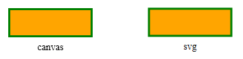

# g2.svg

g2-svg is the [SVG](http://www.w3.org/Graphics/SVG/) addon for [_g2_](https://github.com/goessner/g2),
a 2D graphics command queue library. Maybe you want to [learn more](https://github.com/goessner/g2) about _g2_.

## Example

```html
<canvas id="c" width="200", height="100"></canvas>
<span id="svg" data-width="200" data-height="100"></span>
<script src='g2.js'></script>
<script src='g2.svg.js'></script>
<script>
    g2().style({ls:"green",fs:"orange",lw:3})                // create g2 object and add style.
        .rec(40,30,120,40)                                   // add rectangle.
        .exe(document.getElementById("c").getContext("2d"))  // render to canvas.
        .exe(document.getElementById("svg"));                // render as svg to 'span' element.
</script>
```


In order to create SVG output _g2_'s `exe` command can be used. `exe`'s first argument always must be a
suitable rendering context. Providing such a renderer we have two possibilities:

SVG Container | Example | Comment
-------- |------- | ---
Any HTML container element | `<div data-width="200" data-height="100"></div>` | `data-width` and `data-height` attributes have to be provided in order to specify the viewport size. The SVG markup will be inserted into that element then via `innerHTML`. So previous content gets overwritten. 
Any Javascript object | `{ width:200, height:100 }` |  An arbitrary javascript object providing at least both a `width` and a `height` property. The SVG markup will be written as a string to a new or existing `svg` property.

Since _g2_ has no idea of the viewport size while building the command queue, the rendering context has to provide that information.

The SVG output of the example above reads:
```html
<svg width="200" height="100" fill="transparent" stroke="black" 
     font-family="serif" font-style="normal" font-size="12" font-weight="normal">
  <g stroke="green" fill="orange" stroke-width="3">
    <rect x="40" y="30" width="120" height="40"/>
  </g>
</svg>
```

You can combine _g2_ and SVG in two variants.

Use case | File | Comment
-------- |------- | ---
Addon | `g2.svg.js` | Use if you want both - canvas and SVG rendering. 
Standalone | `g2svg.js` |  Prefer if you don't want canvas rendering or in an environment missing canvas like `node.js`.


## Example for `node.js`
```javascript
var fs = require('fs'),                          
    g2 = require('g2svg.js'),                     // load standalone 'g2+svg' file.
    ctx = {width:200,height:100},                 // provide context with viewport size.
    g = g2().style({ls:"green",fs:"orange",lw:3}) // create g2 object and add style.
        .rec(40,30,120,40)                        // add rectangle.
        .exe(ctx);                                // render as svg.

fs.writeFile("./rec.svg", ctx.svg, function(err) { if(err) return console.log(err); });
```

## Tests

See this growing table of [test cases](https://goessner.github.io/g2-svg/test/index.html) with canvas and svg output side by side.